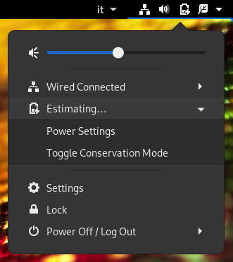

# gnome-shell-extension-ideapad
Lenovo IdeaPad goodies for GNOME Shell

*At the moment the extension only provides an easy and user-friendly way to toggle the battery conservation mode available on Levono Ideapad laptops and visually get its current state.*

# Installation
Download or clone the repository under `~/.local/share/gnome-shell/extensions/ideapad@laurento.frittella`

# Usage
The extension adds a new entry *Toggle Conservation Mode* to the panel and shows an icon on the status menu to indicate when the battery conservation mode is enabled.

If your particular laptop model supports it, the conservation mode limits battery charging to 55-60% of its capacity to improve battery life. It is particularly useful when the laptop runs on external power most of the time.

# Additional Required Settings
Your desktop user needs read-and-write access to a specific sysfs file that is normally owned by the root user. The easiest way to achieve that is using `sudo`. The following steps have been tested on Debian, but they should work on any modern GNU/Linux system. In case of doubts, please refer to your specific distribution documentation.

Add the following entry to your system sudoers configuration (e.g. `/etc/sudoers.d/ideapad`)
~~~
%sudo ALL=(ALL) NOPASSWD: /usr/bin/tee /sys/bus/platform/drivers/ideapad_acpi/VPC????\:??/conservation_mode
~~~
To make sure the `ideapad_laptop` kernel module gets loaded automatically at boot, simply add it to the file `/etc/modules`

To summarize and for easy reference...
~~~
$ echo "%sudo ALL=(ALL) NOPASSWD: /usr/bin/tee /sys/bus/platform/drivers/ideapad_acpi/VPC????\:??/conservation_mode" | sudo tee /etc/sudoers.d/ideapad
$ echo "ideapad_laptop" | sudo tee -a /etc/modules
~~~
